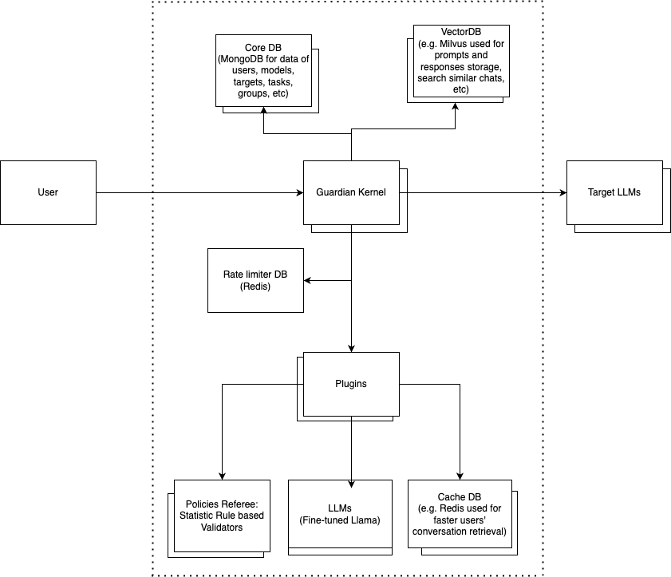

# LLM Guardian System
Welcome to the LLM Guardian System organization! This repository houses all components of our innovative solution for safeguarding Large Language Models (LLMs) against malicious inputs while maintaining high performance and scalability. This project is a collaborative effort by Amir Karimi, Chaima Jaziri, and Liam Johnston as part of the SOEN 691 Project (Fall 2024).

## Kernel Project
You can find the Guardian Kernel project open here:
https://github.com/AMK9978/Guardian

## Getting Started Writing Plugins
The Kernel supports an unlimited number of plugins that operate based on the associated **Task** to apply to certain **Users** or **Groups**. See the 
[Demo](https://github.com/LLMGuardian/BasicJudge) project to learn how to develop a plugin.

## 📌 Project Overview

The LLM Guardian System introduces a next-generation firewall specifically designed for LLM environments. As LLMs become increasingly integral to software engineering, they are also more susceptible to security risks such as prompt injection attacks. This project addresses these challenges by:

Protecting LLMs: Scanning and filtering malicious inputs and outputs.
Optimizing Performance: Utilizing modular, scalable architecture to ensure efficient handling of input loads.
Enhancing Usability: Maintaining smooth user interactions by reducing false positives and ensuring legitimate prompts pass seamlessly.
Facilitating Research: Offering an evaluation framework for security, scalability, and reliability.

🔍 **Key Features:**

Policies Referee: is a plug-in that uses static, manually crafted rules and patterns to act as a pre-display filter between user inputs and a large language model (LLM)
Modular Architecture: Designed for flexibility, extensibility, and ease of integration with existing systems.
Real-Time Monitoring: Incorporating tools like Prometheus and Grafana for effective system monitoring and optimization.
Dataset Integration: Leveraging comprehensive datasets to evaluate and enhance system robustness.

🏗️ **Organization Structure:**

This GitHub organization is divided into multiple repositories, each focusing on a specific aspect of the project:

Core Guardian Engine: The heart of the system, managing the modular pipeline and coordinating between components.
API Gateway: Handles rate limiting, authentication, and load balancing.
Database Systems: Stores user data, embeddings, and cached interactions for improved performance.
Evaluation Framework: Tools and scripts for testing scalability, filtering effectiveness, and latency.

## Architecture Diagram

Below is the architecture of the LLM Guardian System:

🤝  **Contributors:**
- System Design and Kernel:
Amir Karimi (Queen’s University)
Email: a.karimi@queensu.ca

- Referee Plugin:
Chaima Jaziri (Concordia University)
Email: chaima.jaziri@mail.concordia.ca

- Fine-tuned LLM-based Plugin:
Liam Johnston (Queen’s University)
Email: 24rrvk@queensu.ca

🌟 **Vision:**

The LLM Guardian System aspires to be a cornerstone in the field of Software Engineering for AI, enabling secure, efficient, and scalable LLM deployments across diverse contexts. By building and sharing this tool, we aim to contribute significantly to the software engineering and AI communities.

